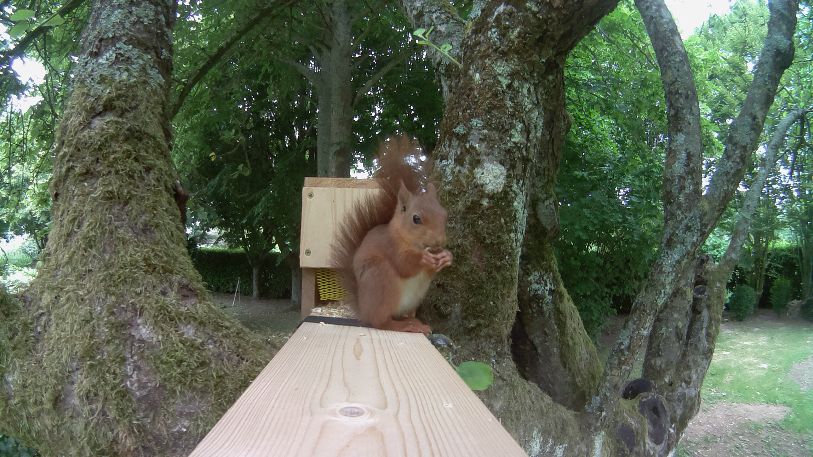

# Squirrel_detector
Squirrel_detector




## Material:
```
RaspberryPi + SD card : https://www.amazon.fr/Raspberry-Pi-3-Mod%C3%A8le-B-Carte-m%C3%A8re/dp/B07BDR5PDW/ref=sr_1_10?__mk_fr_FR=%C3%85M%C3%85%C5%BD%C3%95%C3%91&dchild=1&keywords=raspberry&qid=1591701953&s=computers&sr=1-10
(any RPi model will fit, maybe avoid using a RPi4 (overkill + heat))
Camera : https://www.amazon.fr/Waveshare-Raspberry-Camera-Fisheye-Raspberry-pi/dp/B00W9BIVL8/ref=pd_day0_147_5/260-5767670-7540537?_encoding=UTF8&pd_rd_i=B00RMV53Z2&pd_rd_r=eada2bcf-6cba-4e5f-a39d-fc42470e45ef&pd_rd_w=x8LDt&pd_rd_wg=npx3k&pf_rd_p=d0e20867-8bc1-4681-ae06-595fd1a37cc6&pf_rd_r=6PFJGPFVSA3QQK30FEJT&refRID=6PFJGPFVSA3QQK30FEJT&th=1
ToF distance sensor : https://www.amazon.fr/gp/product/B07RWT9D5Z/ref=ppx_yo_dt_b_asin_title_o07_s00?ie=UTF8&psc=1
Battery pack : https://www.amazon.fr/gp/product/B07HK5VGB6/ref=ppx_yo_dt_b_asin_title_o00_s00?ie=UTF8&psc=1
Jumper cables
```

## instructions:

### clone the repo

You may need to adapt the threshold variable depending on your installation... Mine is 50cm long from detector to feedingbox, so the threshold value should be distance - 1 (to avoid false positives)

### wire distance sensor

### wire camera, install and activate it
```
sudo apt-get install python-picamera python3-picamera
sudo raspi-config -> interfaces -> camera -> activate OK
```

### add a cron:
```
@reboot cd /home/pi/Squirrel_detector && python3 Squirrel_detector.py &
```

### Reboot and install everything... 
A camera test shot is made on start, everything is logged in activity.log file

This project is under MIT licence which means you can share, use, modify it if you cite the author (me)... Thanks !
